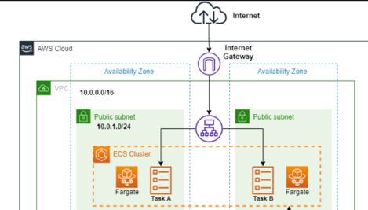

* Set the AWS credentials using:
    * An IAM role if running on a CICD tool
    * An AWS shared credentials file if running locally
* Add a module definition to the `main.tf` file, only
* Extract all necessary information through data blocks and avoid hardcoding parameters
* Unless it's absolutely necessary, do not add any more resource definitions in the main implementation, but opt to add
  them to the module and/or create a new module

#### Init the infrastructure and backend
```shell
terraform init
```

#### Checking the infrastructure plan outputs
```shell
terraform plan
```

#### Run root terraform module
```shell
terraform apply
```

### Infrastructure
The module consists of three main components:
1. ecr registry
2. ecs cluster with task and service
3. nlb
